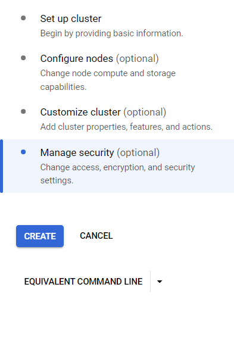

# Analysis of Motor Vehicle Collisions in New York City with PySpark and MapReduce

This guide will help setup the dataproc cluster and apache spark used for this project. We use Google Cloud for this, so as prerequisite you need a google account and a billing account associated with it to access the google cloud console

1. Log in to the google cloud console and select dataproc from the side panel or use the search bar 


1. The dataproc interface will look like this proceed with **CREATE CLUSTER**


3. Select Cluster on Compute engine this will use the google compute engine to create the virtual machines used for master and worker nodes


4. In the following steps select the settings for the cluster.

select a name for the cluster and select the cluster type we use 'Standard'


Choose the subnetwork as default


Check the Component gateway and select Jupyter Notebook


In the Configure node select the node configurations 

we will use E2 instances

1 Master node and 2 Worker nodes


Uncheck the internal IP only option


Rest settings keep it as default


5. Create the cluster using **CREATE**



The dataproc will start provisioning the resources and will install all the required softwares.


6. Once the Cluster is up and running go to **WEB INTERFACES**
   select jupyterlab to open the jupyter interface 


7. The jupyterLab interface will look like this, In launcher select the console option


This will open a terminal window with root user


8. We will execute the following commands to setup the files from the git repository 

``` su dataproc ```

``` cd ~ ```

``` git clone https://github.com/ankithbjoseph/dia-2024-project.git ```

``` cd dia-2024-project/ ```


9. This will download the required files , In the file explorer navigate to the folder ```home/dataproc/dia-2024-project/```

10. Open the notebook ``` x23185813.ipynb ```


11. Run All cells 


